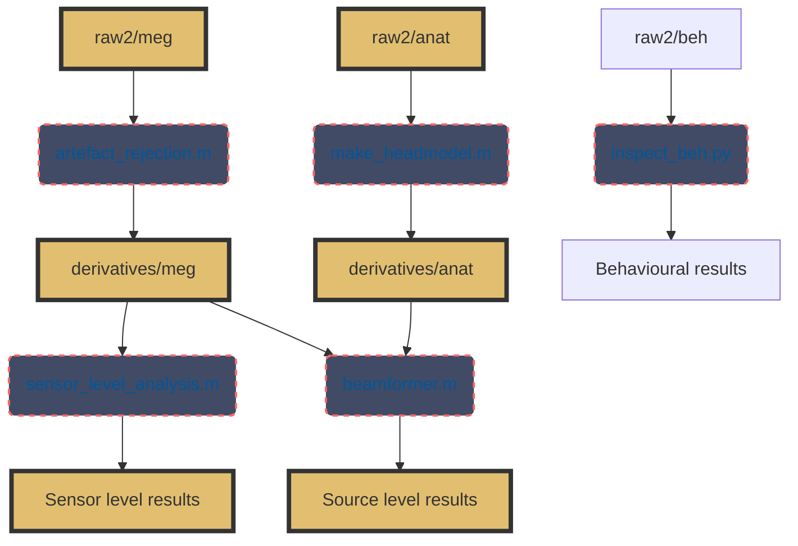

# MEG-AHAT: Propagation of spectral flicker during visual- and non-visual cognitive tasks

Author: Mark Alexander Henney

Principle Investigator: Robert Oostenveld

Collaborators: Henrik Hansen, Marcus Carstensen, Kristoffer Madsen, Eelke Spaak

This repository contains the files required to run the experiment, currate the data, and run the analyses.

## About the Project <a name="about-the-project"></a>

MEG-AHAT is run at the Donders Center for Cognitive Neuroimaing (DCCN) in collaboration with the Technical University of Denmark and OptoCeutics ApS (OC).
It investigates the effects of 40 Hz visible and *invisible spectral flicker* (see [Carstensen et. al. 2020](https://doi.org/10.1117/12.2544338)) on the brain during a visual attention (VA) task and a non-visual working memory (WM) task with simultaneous megnetoencephalography (MEG).

See also the [`DCCN project proposal slides`](protocol/Invisible-Flicker_aka_MEG-AHAT_project_PPM.pptx).


# Table of contents

1. [About the Project](#about-the-project)
2. [Data Analysis](#data-analysis)
	1. [40 Hz Artefact Removal](#40-hz-artefact-removal)
	2. [Sensor Level Analysis](#sensor-level-analysis)
	3. [Source Level Analysis](#source-level-analysis)
	4. [Behavioural Analysis](#behavioural-analysis)
3. [Experiment Management](#experiment-management)
	1. [Dependencies](#dependencies)
	2. [Quick-Start Guide](#quick-start-guide)
	3. [Code Structure](#code-structure)
	4. [Advanced Options](#advanced-options)
4. [Testing](#testing)


{DATA_MANAGEMENT}

## Data Analysis <a name="data-analysis"></a>

The overall data analysis pipeline is defined by the flowchart, in which `.m` and `.py` files are found in the `/analysis/` directory:



### 40 Hz Artefact Removal <a name="40-hz-artefact-removal"></a>

### Sensor Level Analysis <a name="sensor-level-analysis"></a>

### Source Level Analysis <a name="source-level-analysis"></a>

### Behavioural Analysis <a name="behavioural-analysis"></a>


## Experiment Management <a name="experiment-management"></a>

### Dependencies <a name="dependencies"></a>

The experiments require visual presentations and participant feedback is implemented in Python with `psychopy`, and light stimulation with custom and proprietary equipment and drivers are provided by OC. The required software can be installed by:

```
pip install -r requirements.txt
```

Note that the proprietary `libLEDController` package is not publicly available.

#### Portable-Git for DCCN MEG presentation PC

Git is not installed on the DCCN MEG presentation PC, which is why the path to a (portable) Git executable can be set with [`test_util.set_git_executable_path`](tests/test_util.py#L36). Some additional GitPython wrappers are also contained in `test_util`.


### Quick-Start Guide <a name="quick-start-guide"></a>

Two scripts are provided in the root directory to prepare, run, and save outputs for the experiments. Update the `SUB`, `SES`, and `RUN` constants appropriately before executing the script.

### Code Structure <a name="code-structure"></a>

#### Experiment Managers

Control of the two experiments, trial condition randomisation, and progress monitoring is implemented with the two classes 
[`ExperimentManagerVA`](experiment_management/experiment_manager_va.py#L15)
and [`ExperimentManagerWM`](experiment_management/experiment_manager_wm.py#L13) for the VA- and WM-experiments, respectively. Internally, they are built on a common parent class [`ExperimentManagerBase`](experiment_management/experiment_manager_base.py#L11) which handles most of the shared data- and experiment flow management.

Experimental settings such as durations, blocks, repetitions etc. are configured manually in [`experiment_va_settings.py`](experiment_management/experiment_va_settings.py) and [`experiment_wm_settings.py`](experiment_management/experiment_wm_settings.py) for the VA and WM experiments, repectively. These are loaded by the manager classes.

#### Experiment Triggers

Serial interface with the BITSI trigger system is controlled by the [`ExperimentTrigger`](experiment_management/experiment_trigger.py#L27) class. It inherits from the [`Serial`](https://pyserial.readthedocs.io/en/latest/pyserial_api.html) object as a thin wrapper with standard values specified in the [DCCN BITSI documentation](https://intranet.donders.ru.nl/index.php?id=lab-bitsi&no_cache=1&sword_list%5B%5D=bitsi).

At instantiation of the `ExperimentTrigger` object, the BITSI is automatically programmed to trigger mode, and the trigger length set to 30 ms.

It implements a function [`send_trigger`](experiment_management/experiment_trigger.py#L118), which takes a single unsigned 8-bit integer, encodes it as an ASCII character, and writes this to the BITSI. The experiment managers use this to send distinct trigger codes for each event in a trial.

```python
## Example of using the ExperimentTrigger
# Import the experiment trigger
from experiment_management.experiment_trigger import ExperimentTrigger as ET
et = ET() # The BITSI is reprogrammed by the `prepare_trigger` method
et.prepare_trigger()
et.send_trigger(65) # 65 is encoded as ASCII to 'A' and written to serial
```

### Advanced Options <a name="advanced-options"></a>

Several handy features are implemented to handle the experiments.

#### Setting custom root

A custom root directory can be defined in which experiment data is stored. This can be done either at instantiation of the experiment objects, when making experiment data with `make_and_save_experiment_data`, when loading existing experiment data from a file with `load_experiment_data` - all via the `root` argument.

In the quick-start scripts, the root is specified at instantiation:

```python
from pathlib import Path

from experiment_management.experiment_manager_va import VisualAttentionExperimentManager

SUB = 42
SES = 42
RUN = 42

ROOT = Path(__file__).parent / "data"

experiment_manager = VisualAttentionExperimentManager(
    sub=SUB, ses=SES, run=RUN, root=ROOT
)
```

Note that the `root` argument is required the first time calling `make_and_save_experiment_data` and `load_experiment_data` if it was not given at instantiation. In these cases, the root is subsequently stored in `experiment_manager.root` property.

#### Setting experiment progresss

In case of a crash during the experiment, it can be restarted at a customly selected trial. The experiment data
is saved to the `>ROOT</data/` directory, and completed trials are indicates in the "completed" column.

To start an experiment after the already completed trials, first set the trial progress, then run the experiment:

```python
trial_progress = 10 # NOTE: trial numbers are 0-indexed
experiment_manager.set_trial_progress(trial_progress)
experiment_manager.run_experiment()
```

In this case, the experiment will run from trial 10 (the 11th).

#### Using a custom random seed

When creating experiment data, the conditions are randomised uniquely based on the provided `sub`, `ses`, and `run` arguments at instantiation. In `make_and_save_experiment_data`, a custom seed can be provided via the `seed` argument, though this is not necessarly desireble.

## Testing <a name="testing"></a>

A test suite is provided in `tests/` based on the `unittest`-module available in the standard Python library. To run this locally, use:

```
python -m unittest discover tests/
```
